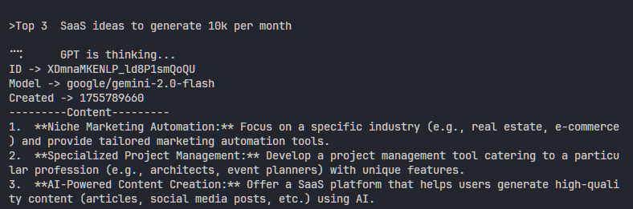

# Rust GPT Chat Client

This is a simple Rust-based CLI application that interacts with a GPT-like API to generate responses based on user input. The app communicates with the AIML API using Hyper for HTTP requests, and the dotenv crate is used to manage API keys securely. The app utilizes spinners to provide feedback while waiting for responses from the API.

## Features

- **CLI Interface**: Type your query and get concise, straight-to-the-point responses from the AI.
- **Customizable**: Supports changing parameters such as temperature, max tokens, and model.
- **Spinners**: Provides a waiting animation to indicate when the model is processing.
- **Environment Configuration**: Uses `.env` for secure API key management.

## Requirements

- Rust (latest stable version)
- `tokio` async runtime
- `.env` file containing the API key

## Installation

1. Clone the repository:

    ```bash
    git clone https://github.com/geekygeeky/rust-gpt
    cd rust-gpt
    ```

2. Install dependencies:

    ```bash
    cargo build
    ```

3. Create a `.env` file in the root directory with your API key:

    ```text
    API_KEY=your_api_key_here
    ```
    > Get your API key here: https://aimlapi.com/app/keys

4. Run the application:

    ```bash
    cargo run
    ```

## Usage

1. The CLI will prompt you with `>`.
2. Type your input and press enter to get a response from the AI.
3. Type `exit` to quit the program.

## Example

```bash
> Hello, how are you?
ID -> some_id
Model -> google/gemini-2.0-flash
Created -> 1674893520
---------Content---------
I am fine, thank you. How can I assist you today?
```

## 📷 Preview



---

Feel free to modify the model, temperature, or other parameters by changing the code.
